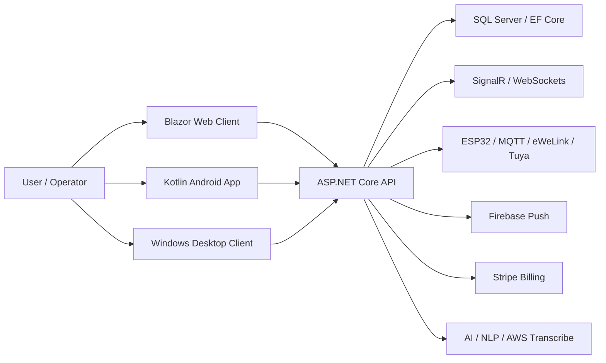

# StarkAid

[](https://github.com/Starkaid01/StarkAidApi/actions/workflows/ci.yml)

`StarkAid` is a multi-client automation platform built around a central `ASP.NET Core` backend, a `Blazor` web surface, a Windows desktop client, and a `Kotlin` Android application.

This repository is the flagship public sample because it shows a real product problem being solved: device control, support, account flows, scheduling, monetization, and operational tooling across more than one client.


## Public history note

The public commit history is shorter than the actual product history.

This matters because the system was originally developed as a private product codebase and only later prepared for public review. That means recent public commits overrepresent:

- sanitization and secret removal
- documentation and setup cleanup
- reviewability improvements
- CI and public build validation

So the right way to read this repository is:

- older product depth is visible in the solution shape and runtime surfaces
- newer public commits show the effort to make that work reviewable, reproducible, and safer to publish

## What problem this solves

Home automation products usually fragment fast:

- one app controls devices
- another surface handles support
- admin and operational flows live somewhere else
- credentials, billing, and scheduling become separate concerns

`StarkAid` centralizes that into one product stack:

- authenticated user and device management
- automation commands across connected devices
- browser admin and support tooling
- Android and desktop clients connected to the same backend
- realtime operator and support flows
- subscriptions, push notifications, and scheduled actions

## Why this repo is worth reviewing

This is not a tutorial repository and not a single CRUD app.

It demonstrates:

- backend architecture with `ASP.NET Core`, `EF Core`, `JWT`, `SignalR`, and SQL-backed state
- cross-surface delivery with API, web, desktop, and Android clients
- connected-device orchestration for `ESP32`, `eWeLink`, and `Tuya / Thingclips`
- support and maintenance workflows that go beyond user-facing CRUD
- real-world configuration cleanup to separate public code from private credentials

## Technical decisions

- `JWT` was chosen because the product has multiple clients (`Blazor`, Android, desktop, connected-device flows) and needed stateless auth that does not depend on a single server-side session model.
- a runtime `Api-Key` is layered on top of authenticated flows because devices and product surfaces need a second boundary for command and device-related requests after login.
- `SignalR` was chosen for realtime support and operator feedback because maintenance, support chat, and command status are user-facing flows where polling would add friction and latency.
- `MQTT`, UDP, and multiple vendor integrations exist together because the real problem is heterogeneous automation, not one perfect device protocol.
- `EF Core` with `SQL Server` was chosen because auth, billing, devices, support, and scheduled work all need transactional persistence in the same product boundary.
- hosted services were used because schedules, reminder processing, token resets, and automation-related background work are part of the product itself, not external cron-only concerns.

## Proof in under 30 seconds

If you only have a minute, use this order:

1. Open the live surface: [starkaidautomacao.runasp.net](https://starkaidautomacao.runasp.net/)
2. Watch the product video: [YouTube demo](https://www.youtube.com/watch?v=Iexo9cl87lk)
3. Scan the architecture snapshot below
4. Jump to the API surfaces table to see the breadth of the backend

## What is already working

- public live web surface: [starkaidautomacao.runasp.net](https://starkaidautomacao.runasp.net/)
- public product demo video: [YouTube](https://www.youtube.com/watch?v=Iexo9cl87lk)
- multi-project solution with backend, web, desktop, Android, and helper service
- green solution build from the public codebase
- public documentation for environment setup and secret boundaries

## Production and runtime signals

The repository already contains concrete production-oriented decisions:

- structured JSON logging with `Serilog`
- `JWT` auth with support for websocket and `SignalR` token transport
- rate limiting by IP and authenticated user
- `EF Core` retry behavior and SQL command timeout configuration
- background services for schedules, reminders, subscription checks, and periodic maintenance
- middleware for runtime `Api-Key` enforcement and command throttling
- realtime hubs for devices, ESP flows, avatar interactions, and support

These are not placeholders in the README; they are wired in the application bootstrap.

## Architecture snapshot



## Repository map

```text
StarkAid/
├── StarkAid.Api/            # ASP.NET Core backend
├── StarkAid.Web/            # Blazor web client
├── StarkAid.WindowsForms/   # Windows desktop client
├── StarkAid.AudioResolver/  # Audio helper service
└── starkaidautomacao/       # Kotlin Android client
```

## Product surfaces

| Surface | What it does |
| --- | --- |
| `StarkAid.Api` | authentication, device orchestration, schedules, support, subscriptions, telemetry, notifications |
| `StarkAid.Web` | browser-based admin, support, dashboards, and operator tooling |
| `StarkAid.WindowsForms` | desktop operational surface within the same product ecosystem |
| `starkaidautomacao` | Android app for device control, voice-related flows, routines, and support |
| `StarkAid.AudioResolver` | helper service for audio and media-related flows |

## Key API surfaces

These are the backend areas that make the repository useful for technical review:

| Surface | Route group | What it shows |
| --- | --- | --- |
| Authentication | `api/v1/Auth` | JWT login, refresh-token flow, user auth lifecycle |
| Device management | `api/v1/Devices` | user devices, command-driven automation, persisted device model |
| ESP32 devices | `api/v1/DispositivosEsp` | UDP/ESP device registration, update, and ping flows |
| Social commands | `api/v1/ComandosSociais` | command-response customization and operator-managed interactions |
| Maintenance | `api/v1/manutencao` | remote support, cache/data actions, app/software maintenance flows |
| Support | `api/v1/Suporte` and `/hubs/support-chat` | realtime support chat and operator-facing support routing |
| Billing | `api/v1/Checkout`, `api/v1/StripeWebhook` | subscriptions and monetization hooks with Stripe |
| Notifications | `api/v1/Notifications`, `api/v1/Notificacoes` | push and admin notification flows |
| Scheduling | `api/v1/Agendamentos`, `api/v1/Rotinas` | delayed and recurring automation |
| Telemetry | `api/v1/Telemetry` | AI/event and operational telemetry surfaces |

## Main stack

- `.NET 8`
- `ASP.NET Core`
- `Blazor`
- `Entity Framework Core`
- `SQL Server`
- `SignalR`
- `JWT`
- `Serilog`
- `Kotlin`
- `Android SDK`
- `Room`
- `Retrofit`
- `Firebase`
- `MQTT`
- `AWS Transcribe`
- `Stripe`

## CI

This repository now includes a public GitHub Actions workflow that validates the published solution with `restore` + `build`.

Workflow file:

- [.github/workflows/ci.yml](.github/workflows/ci.yml)

## Engineering notes

Deeper review docs:

- [docs/ENGINEERING_DECISIONS.md](docs/ENGINEERING_DECISIONS.md)
- [docs/EVOLUTION_NOTES.md](docs/EVOLUTION_NOTES.md)

## Local setup order

1. Configure and run `StarkAid.Api`
2. Point `StarkAid.Web` to the local API
3. Configure the Android app under `starkaidautomacao`
4. Validate login, `SignalR`, device operations, and support flows

## Requirements

- `.NET SDK 8`
- `SQL Server`
- `Android Studio`
- `JDK 17`
- `WebView2 Runtime`

## API configuration

The backend reads configuration from:

- `appsettings.json`
- `appsettings.{Environment}.json`
- environment variables

Template file:

- [StarkAid.Api/appsettings-template.json](StarkAid.Api/appsettings-template.json)

### Bootstrap steps

1. Copy `StarkAid.Api/appsettings-template.json` to `StarkAid.Api/appsettings.Development.json`, or use `dotnet user-secrets` and environment variables.
2. Set the SQL Server connection string.
3. Make sure the Firebase credentials file path exists on the local machine.
4. Apply migrations and start the API.

### Useful commands

```powershell
dotnet restore
dotnet ef database update --project StarkAid.Api
dotnet build StarkAid.sln -v minimal
dotnet run --project StarkAid.Api
```

### Expected environment variables and keys

Use `__` in environment variable names to map nested JSON sections in .NET.

| Key | Required | Purpose |
| --- | --- | --- |
| `ConnectionStrings__DefaultConnection` | Yes | Main SQL Server database |
| `Jwt__Key` | Yes | JWT signing key |
| `Jwt__Issuer` | Yes | JWT issuer |
| `Jwt__Audience` | Yes | JWT audience |
| `Firebase__CredentialsPath` | Yes | Path to `firebase-adminsdk.json` |
| `Tuya__AccessId` | If using Tuya | Tuya API credential |
| `Tuya__AccessSecret` | If using Tuya | Tuya API secret |
| `Tuya__BaseUrl` | If using Tuya | Tuya API base URL |
| `Tuya__CountryCode` | If using Tuya | Country code used by the integration |
| `WppConnectOptions__BaseUrl` | If using WPP | Base endpoint for the WhatsApp service |
| `WppConnectOptions__TokenDeAutenticacao` | If using WPP | Internal token for the WPP service |
| `WppConnectOptions__NovoDominio` | Optional | Alternate WPP domain |
| `WppConnectOptions__UserId` | Optional | Technical user for WPP |
| `NlpConnectOptions__BaseUrl` | If using external NLP | Base endpoint for the NLP service |
| `NlpConnectOptions__TokenDeAutenticacao` | If using external NLP | NLP service token |
| `NlpConnectOptions__NovoDominio` | Optional | Alternate NLP domain |
| `NlpConnectOptions__UserId` | Optional | Technical user for NLP |
| `AiTelemetry__CostPer1KTokens` | Optional | Reference cost for telemetry |
| `AiTelemetry__DefaultTokensPerInteraction` | Optional | Default token estimate per interaction |
| `IaApiKeys__GroApiKey` | If using AI provider | Groq API key |
| `IaApiKeys__OpenRouterKEY` | If using AI provider | OpenRouter API key |
| `AWS__AccessKey` | If using transcription | AWS access key |
| `AWS__SecretKey` | If using transcription | AWS secret key |
| `AWS__Profile` | Optional | Local AWS profile |
| `AWS__Region` | If using transcription | AWS region |
| `Spotify__ClientId` | If using Spotify | Spotify application client ID |
| `Spotify__ClientSecret` | If using Spotify | Spotify application client secret |
| `Spotify__RedirectUri` | If using Spotify | Spotify OAuth redirect URI |
| `StripeSettings__SecretKey` | If using billing | Stripe secret key |
| `StripeSettings__PublishableKey` | If using billing | Stripe publishable key |
| `StripeSettings__WebhookSecret` | If using billing | Stripe webhook secret |
| `StripeSettings__PriceIdNivel2` through `StripeSettings__PriceIdNivel7` | If using billing | Price and product IDs |
| `StripeSettings__CheckoutFrontendUrl` | If using billing | Checkout frontend URL |
| `StripeSettings__AppDeepLink` | Optional | Android deep link |
| `StripeSettings__SoftwareDeepLink` | Optional | Desktop client deep link |
| `Mqtt__Broker` | If using ESP32 or MQTT | MQTT broker address |
| `Mqtt__Port` | If using ESP32 or MQTT | MQTT broker port |
| `Mqtt__Username` | If using ESP32 or MQTT | MQTT username |
| `Mqtt__Password` | If using ESP32 or MQTT | MQTT password |
| `EmailSettings__From` | If using email | Sender address |
| `EmailSettings__SmtpServer` | If using email | SMTP server |
| `EmailSettings__Port` | If using email | SMTP port |
| `EmailSettings__Username` | If using email | SMTP username |
| `EmailSettings__Password` | If using email | SMTP password |
| `Ewelink__ClientId` | If using eWeLink | eWeLink client ID |
| `Ewelink__ClientSecret` | If using eWeLink | eWeLink client secret |
| `Ewelink__RedirectUri` | If using eWeLink | eWeLink redirect URI |
| `YouTube__ApiKey` | If using music search | YouTube API key |

### Operational notes

- The system uses `JWT` and a runtime `Api-Key` per user or device after authentication.
- That `Api-Key` is not a build secret. It is generated by the backend during login or device registration.
- Before any deeper public expansion, the right next step is credential rotation for every real provider that has ever been used by this product.

## Web client configuration

Template file:

- [StarkAid.Web/wwwroot/appsettings-template.json](StarkAid.Web/wwwroot/appsettings-template.json)

### Setup steps

1. Copy `StarkAid.Web/wwwroot/appsettings-template.json` to `StarkAid.Web/wwwroot/appsettings.json`.
2. Set `Api:BaseUrl` to the API you want the client to use.
3. If the `eWeLink` browser flow is enabled, set `Ewelink:ClientId` and `Ewelink:ClientSecret`.
4. Run the web client.

```powershell
dotnet restore
dotnet run --project StarkAid.Web
```

### Important note about secrets in Blazor WebAssembly

`StarkAid.Web` runs in the browser. Any secret placed in `wwwroot/appsettings.json` is visible to the client. If a provider value is truly secret, it should move to the backend instead of staying in the browser configuration.

## Android configuration

The Android app has dedicated setup documentation here:

- [starkaidautomacao/README.md](starkaidautomacao/README.md)

At a high level, local setup expects:

- `google-services.json`
- `Thingclips / Tuya` identifiers
- `AdMob` and `Unity Ads` IDs
- backend `REST`, `SignalR`, `WebSocket`, and Spotify callback URLs
- Spotify application credentials if the flow remains client-side

## Public references

- live web and API surface: [starkaidautomacao.runasp.net](https://starkaidautomacao.runasp.net/)
- product demo video: [YouTube](https://www.youtube.com/watch?v=Iexo9cl87lk)
- Android repo: [starkaidautomacao](https://github.com/Starkaid01/starkaidautomacao)

## Repository status

This is real product code and has already gone through an initial public sanitization pass. The professionalization path from here is still clear:

- rotate any historic provider credentials that were ever used privately
- tighten nullability and warning cleanup across `StarkAid.Web`
- keep separating client-safe configuration from true backend secrets
- expand CI beyond build validation once the public test strategy is stable

Additional notes:

- [GITHUB_CLEANUP_NOTES.md](GITHUB_CLEANUP_NOTES.md)

## License

See `LICENSE`.
