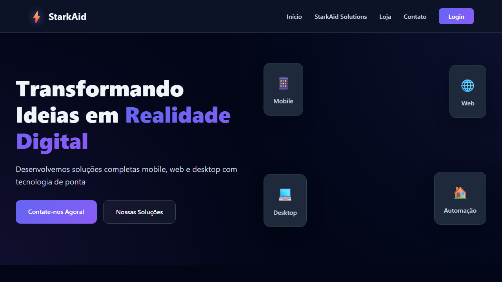
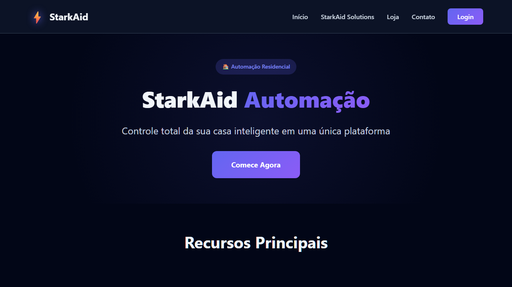
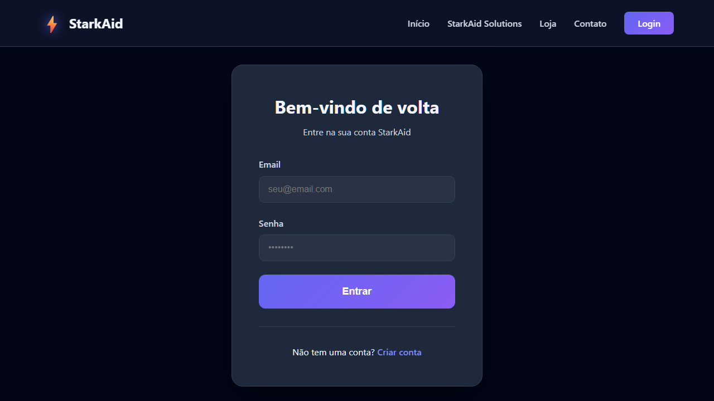
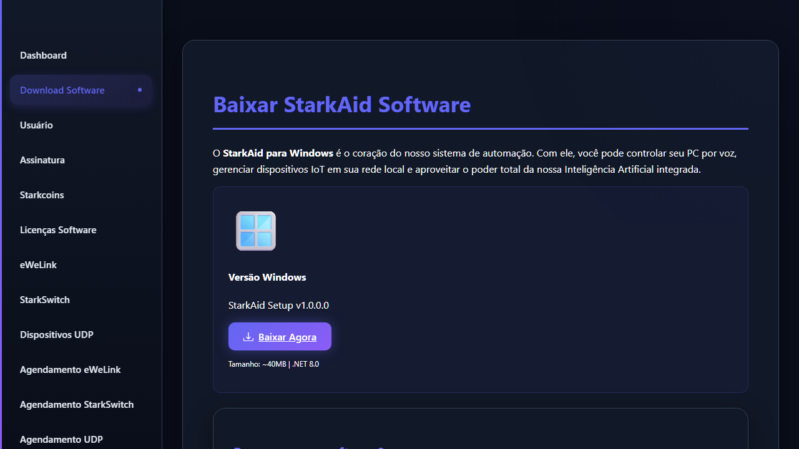
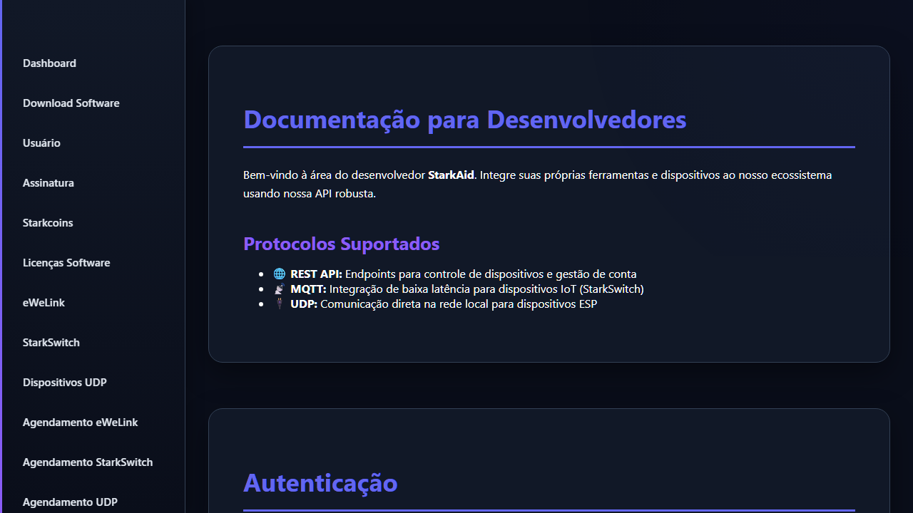
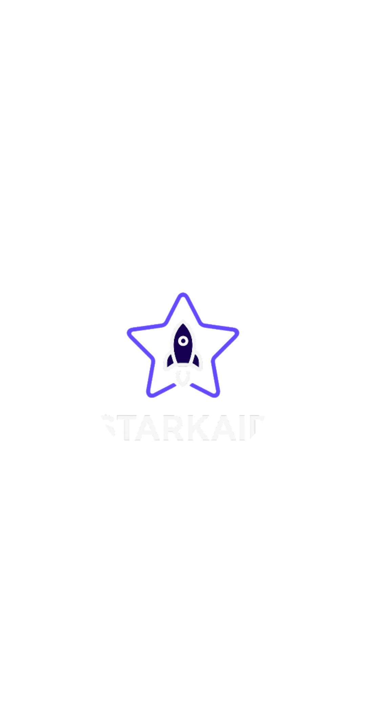
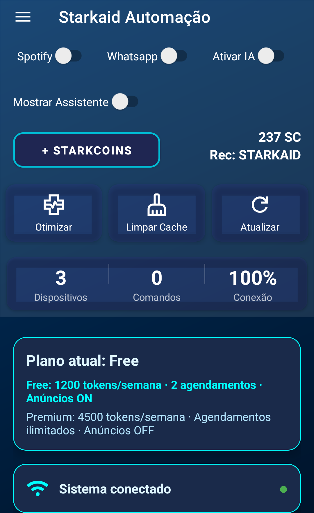
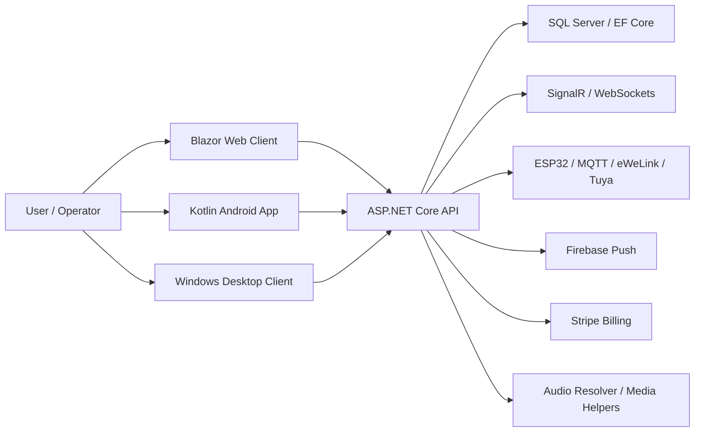

[](https://github.com/Starkaid01/StarkAidApi/actions/workflows/ci.yml)

# StarkAid

`StarkAid` is a real multi-client automation product built around a central `ASP.NET Core` backend, a `Blazor WebAssembly` front-end, a Windows desktop client, an Android app in `Kotlin`, and supporting runtime services for audio, support, scheduling, and device orchestration.

This repository is the public code review surface for the current product line, not a tutorial sample. It exists to show a real system that already had live users, runtime integrations, and multi-surface delivery before the public cleanup work started.

## Current live map

- public web surface: [starkaidautomacao.runasp.net](https://starkaidautomacao.runasp.net/)
- API base currently consumed by the web client: `https://starkaid.runasp.net`
- product demo video: [YouTube demo](https://www.youtube.com/watch?v=Iexo9cl87lk)

## What problem this solves

Home automation products usually fragment fast:

- one client controls devices
- another handles support
- schedules and routines live elsewhere
- account, billing, and notifications drift into separate tools

`StarkAid` centralizes that into one product boundary:

- authenticated user and device management
- automation commands across connected devices
- browser admin and support tooling
- Android and desktop clients connected to the same backend
- realtime support and operator flows
- subscriptions, push notifications, and scheduled actions

## What is already working

- live public web surface
- current backend and current web client in the same monorepo
- Android app wired to the same API family
- desktop and audio helper projects still build from the public tree
- public setup templates for API, web, and Android configuration

## Why this repo is worth reviewing

This is not a single CRUD sample and not a generated portfolio shell.

It demonstrates:

- backend architecture with `ASP.NET Core`, `EF Core`, `JWT`, `SignalR`, and SQL-backed state
- cross-surface delivery with API, web, desktop, Android, and helper-service code in one codebase
- connected-device orchestration for `ESP32`, `MQTT`, `eWeLink`, and `Tuya / Thingclips`
- support and maintenance workflows that go beyond simple user CRUD
- public-hardening work to separate real code from private credentials and local-only assumptions

## Technical decisions

- `JWT` was chosen because the product has multiple clients and needed stateless auth across web, Android, desktop, and realtime flows.
- a runtime `Api-Key` is layered on top of authenticated flows because device and command traffic needed a second operational boundary after login.
- `SignalR` was chosen for support and operator feedback because maintenance, support chat, and remote command status are realtime user-facing flows.
- `MQTT`, UDP, and vendor-specific integrations coexist because the real product problem is heterogeneous automation, not one ideal protocol.
- `EF Core` with `SQL Server` fits the same boundary owning auth, devices, schedules, support, telemetry, and plans.
- hosted services exist because reminders, schedule processing, token resets, and recurring work are part of the product runtime.

## Public history note

The public commit graph is shorter than the actual product history.

This matters because the codebase lived privately first and only later went through public cleanup. Recent public commits overrepresent:

- secret removal
- configuration externalization
- documentation cleanup
- CI visibility
- reviewability work

That is publicization work, not proof that the product only started recently.

## Proof in under 30 seconds

If you only have a minute, use this order:

1. Open the live web surface: [starkaidautomacao.runasp.net](https://starkaidautomacao.runasp.net/)
2. Watch the product demo: [YouTube](https://www.youtube.com/watch?v=Iexo9cl87lk)
3. Scan the public walkthrough below
4. Jump to the repository map and key runtime surfaces

## Live system walkthrough

The screenshots below were captured from the live public surface on `2026-05-02`.

This walkthrough intentionally stays on public routes. It proves that the product is deployed and reviewable without forcing authenticated actions against a production environment.

### 1. Public landing surface

Route: [`/`](https://starkaidautomacao.runasp.net/)

What this shows:

- the product is live and not just a local-only sample
- the public web surface already communicates the automation use case
- navigation exists for downloads, authentication, solution pages, and docs



### 2. Automation solution page

Route: [`/solutions/automacao`](https://starkaidautomacao.runasp.net/solutions/automacao)

What this shows:

- the repo is attached to a specific business problem instead of a generic portfolio page
- the public site explains device automation, voice control, and command-driven routines
- the product framing matches the backend scope shown in the solution



### 3. Authentication entry point

Route: [`/login`](https://starkaidautomacao.runasp.net/login)

What this shows:

- the system exposes a real authentication surface instead of mock-only navigation
- account entry is already wired into the public product flow
- mobile, desktop, and web clients converge on the same auth model



### 4. Software distribution surface

Route: [`/download`](https://starkaidautomacao.runasp.net/download)

What this shows:

- the product includes installation and distribution concerns
- the public surface already references deliverables beyond the browser client
- this supports the multi-client story shown in the repository layout



### 5. Developer integration docs

Route: [`/docs/desenvolvedores`](https://starkaidautomacao.runasp.net/docs/desenvolvedores)

What this shows:

- the product is not only user-facing; it also exposes an integration story
- the public docs already describe auth and supported protocols such as `REST`, `MQTT`, and `UDP`
- this matches the heterogeneous device and automation scope in the backend



## Android app walkthrough

The screenshots below were captured from the installed Android client on `2026-05-02`.

They were trimmed to remove device chrome and avoid exposing incidental personal context from the test handset while still showing the real UI.

### 1. Launch / brand splash

What this shows:

- the Android client ships with its own branded startup flow
- the mobile app is not a placeholder wrapper around the web surface
- the public repository maps to a running mobile build, not only backend code



### 2. Main automation dashboard

What this shows:

- runtime toggles for voice, WhatsApp, Spotify, and assistant features
- direct user actions for optimization, cache cleanup, refresh, and product credits
- dashboard metrics and plan messaging coming from the current mobile product surface

This capture was intentionally cropped before the weather/location section to keep the portfolio view focused on the product UI.



### 3. Mobile monetization flow

What this shows:

- the Android app includes its own purchase surface instead of delegating everything to the browser
- the product already models in-app credit packs and pricing presentation
- monetization concerns are part of the shipped client, not just backend placeholders


## Architecture snapshot



## Repository map

```text
StarkAid/
├── StarkAid.Api/            # ASP.NET Core backend
├── StarkAid.Web/            # Blazor WebAssembly client
├── StarkAid.WindowsForms/   # Windows desktop client
├── StarkAid.AudioResolver/  # Audio and media helper service
├── starkaid-avatar/         # Shared avatar / visual assets
└── starkaidautomacao/       # Kotlin Android client
```

## Build scope

- `StarkAid.sln` currently builds `StarkAid.Api` and `StarkAid.Web`
- `StarkAid.WindowsForms` builds separately from its own project file
- `StarkAid.AudioResolver` builds separately from its own project file
- `starkaidautomacao` builds through the Android Gradle wrapper

## Key backend surfaces

| Surface | Route group | What it shows |
| --- | --- | --- |
| Authentication | `api/v1/Auth` | JWT login, refresh-token flow, user auth lifecycle |
| Device management | `api/v1/Devices` | user devices, command-driven automation, persisted device model |
| ESP32 devices | `api/v1/DispositivosEsp` | UDP / ESP device registration, update, and ping flows |
| Social commands | `api/v1/ComandosSociais` | command-response customization and operator-managed interactions |
| Maintenance | `api/v1/manutencao` | remote support, cache/data actions, and software maintenance flows |
| Support | `api/v1/Suporte` and realtime hubs | operator-facing support routing and realtime chat |
| Billing | `api/v1/Checkout`, `api/v1/StripeWebhook` | subscriptions and monetization hooks |
| Notifications | `api/v1/Notifications`, `api/v1/Notificacoes` | push and admin notification flows |
| Scheduling | `api/v1/Agendamentos`, `api/v1/Rotinas` | delayed and recurring automation |
| Telemetry | `api/v1/Telemetry` | AI/event and operational telemetry surfaces |

## Production and runtime signals

The repository already contains concrete production-oriented decisions:

- structured JSON logging with `Serilog`
- `JWT` auth with websocket and `SignalR` token transport
- rate limiting by IP and authenticated user
- `EF Core` retry behavior and SQL command timeout configuration
- background services for schedules, reminders, subscription checks, and periodic maintenance
- middleware for runtime `Api-Key` enforcement and command throttling
- realtime hubs for devices, avatar flows, and support

## Main stack

- `.NET 8`
- `ASP.NET Core`
- `Blazor WebAssembly`
- `Entity Framework Core`
- `SQL Server`
- `SignalR`
- `JWT`
- `Serilog`
- `Kotlin`
- `Android SDK`
- `Room`
- `Retrofit`
- `Firebase`
- `MQTT`
- `AWS Transcribe`
- `Stripe`

## CI

Public CI validates the current source tree on GitHub Actions.

Workflow file:

- [.github/workflows/ci.yml](.github/workflows/ci.yml)

## Engineering notes

Deeper review docs:

- [docs/ENGINEERING_DECISIONS.md](docs/ENGINEERING_DECISIONS.md)
- [docs/EVOLUTION_NOTES.md](docs/EVOLUTION_NOTES.md)

## Local setup order

1. Configure `StarkAid.Api`
2. Point `StarkAid.Web` to the API you want to use
3. Configure `starkaidautomacao`
4. Build `StarkAid.WindowsForms` and `StarkAid.AudioResolver` if you want the full local product surface
5. Validate login, realtime flows, support, and device operations

## Requirements

- `.NET SDK 8`
- `.NET SDK 9` for `StarkAid.AudioResolver`
- `SQL Server`
- `Android Studio`
- `JDK 17`
- `WebView2 Runtime`

## API configuration

The backend reads configuration from:

- `appsettings.json`
- `appsettings.{Environment}.json`
- environment variables

Template file:

- [StarkAid.Api/appsettings-template.json](StarkAid.Api/appsettings-template.json)

### Bootstrap steps

1. Copy `StarkAid.Api/appsettings-template.json` to `StarkAid.Api/appsettings.Development.json`, or use `dotnet user-secrets` and environment variables.
2. Set the SQL Server connection string.
3. Make sure the Firebase credentials file path exists on the local machine.
4. Apply migrations and start the API.

### Useful commands

```powershell
dotnet restore
dotnet ef database update --project StarkAid.Api
dotnet build StarkAid.sln -v minimal
dotnet run --project StarkAid.Api
```

## Web configuration

Template file:

- [StarkAid.Web/wwwroot/appsettings-template.json](StarkAid.Web/wwwroot/appsettings-template.json)

For the browser client, keep in mind:

- anything in `wwwroot/appsettings.json` is visible to the browser
- third-party secrets should stay in the API whenever possible
- the current public website points to `https://starkaid.runasp.net`

## Android configuration

The Android app has its own setup guide:

- [starkaidautomacao/README.md](starkaidautomacao/README.md)

At minimum, the app expects:

- `starkaid.local.properties`
- `google-services.json`
- API and web base URLs
- Spotify fallback credentials if the client-side fallback remains enabled
- eWeLink client credentials if the mobile flow remains client-side
- ads IDs and any vendor-specific identifiers you actually use

## Windows and helper services

The desktop client and the audio helper service are still part of the public tree even though they are not in `StarkAid.sln` today:

- [StarkAid.WindowsForms](StarkAid.WindowsForms)
- [StarkAid.AudioResolver](StarkAid.AudioResolver)

They build separately and are kept public because they are part of the actual product surface, not dead folders added for portfolio inflation.
